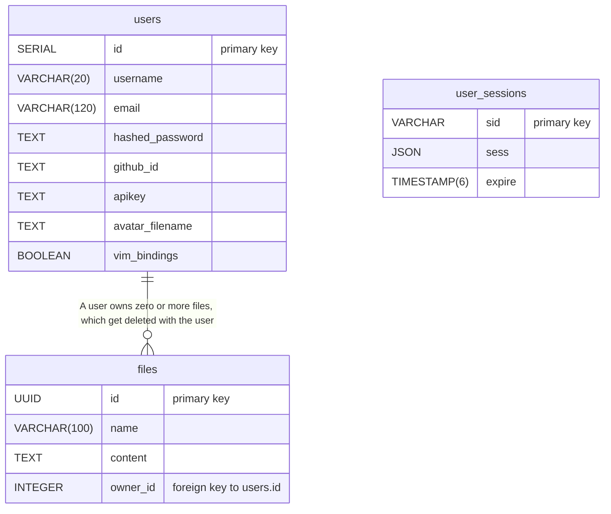

_This repository is a duplicate, created to implement post-submission fixes while preserving [the project's original repository](https://github.com/EyzeCOLD/DiffEd) in the state when the project was graded. Original issues tickets, pull requests, and kanban board may be found there._

# DiffEd

## Table of Contents

- [Description](#description)
- [Instructions](#instructions)
- [Technical Stack](#technical-stack)
- [Database Schema](#database-schema)
- [Resources](#resources)

**Information about the team, how we collaborated, and individual contributions, may be be found in [CONTRIBUTIONS.md](./CONTRIBUTIONS.md).**

## Description

**DiffEd** is a real-time, diff-based, collaborative code editor. Collaborators each edit their own files, and can pick any peer in the workspace to view a live unified diff between the files. Peer edits stream in instantly with no refresh required, and users can accept file changes from peers through Accept buttons in diff chunks.

## Key features:

- Real-time multi-user collaborative editing, powered by Operational Transformation
- Syntax highlighting for a lot of common languages (Markdown, TypeScript, Python, HTML, CSS, SQL, and more)
- Unified diff view for comparing file contents between collaborators
- Optional Vim keybindings in the editor
- Personal file storage with upload, download, rename, and delete
- Secure user accounts with session persistence, including GitHub OAuth
- Fully containerized deployment

## Instructions

**Prerequisites**

| Software       | Minimum version                                                                   |
| -------------- | --------------------------------------------------------------------------------- |
| Docker         | 24.x                                                                              |
| Docker Compose | v2 (bundled with Docker Desktop, or with Docker Engine's `docker-compose-plugin`) |
| Node.js        | 18.x (optional - only needed to run `npm run` scripts from the repo root)         |

The root `npm run` scripts are thin wrappers around `docker compose` commands. If you prefer, you can run the Docker Compose commands in `package.json` directly without Node.js installed.

**Setup**

1. Clone the repository:

   ```sh
   git clone <repo-url> && cd DiffEd
   ```

2. Create the environment file from the template:

   ```sh
   cp backend/.env.example backend/.env
   ```

   Open `backend/.env` and fill in the required values:

   ```
   HTTP_PORT=80
   HTTPS_PORT=443
   POSTGRES_DB=your_database_name_here
   POSTGRES_USER=your_database_user_here
   POSTGRES_PASSWORD=your_database_password_here
   GITHUB_CLIENT_ID=your_github_client_id
   GITHUB_CLIENT_SECRET=your_github_client_secret
   SESSION_SECRET=your_session_secret_here
   ```

3. If you want GitHub authentication to work, create a [GitHub OAuth app](https://docs.github.com/en/apps/oauth-apps/building-oauth-apps/creating-an-oauth-app) and copy the [created OAuth app](https://github.com/settings/developers)'s `GITHUB_CLIENT_ID` and `GITHUB_CLIENT_SECRET` values into `backend/.env`. Otherwise, only authentication with email/username and password will work.

4. Build and start all services:
   ```sh
   npm run up
   ```
   This builds and starts the frontend, backend, PostgreSQL database, and Nginx reverse proxy. The app will be available at **https://localhost** (assuming HTTPS_PORT is set to 443 in backend/.env).

**Other useful commands**

| Command             | Description                                                        |
| ------------------- | ------------------------------------------------------------------ |
| `npm run dev`       | Start in development mode (auto-rebuild both frontend and backend) |
| `npm run stop`      | Stop running containers without removing them                      |
| `npm run start`     | Restart previously stopped containers                              |
| `npm run logs`      | Tail container logs                                                |
| `npm run fclean`    | Tear down containers and delete volumes (resets the database)      |
| `npm run re`        | Full teardown and rebuild from scratch                             |
| `npm run SA`        | Run static analysis (ESLint + Prettier) in a container             |
| `npm run audit`     | Run `npm audit` across the root, shared, backend, and frontend     |
| `npm run auditFix`  | Run `npm audit fix` across the root, shared, backend, and frontend |
| `npm run githook`   | Install the repo's pre-push git hook locally                       |
| `npm run cloneWiki` | Clone the repository wiki into `./wiki/`                           |

## Technical Stack

**Frontend**

- TypeScript: Type-safe JavaScript across the entire codebase
- React: Web component framework
- React Router: Client-side routing
- CodeMirror: Extensible code editor component
- SocketIO: WebSocket client library
- Tailwind: Utility styling-classes
- Zustand: Minimal global state management
- Vite: Build tooling and dev server
- @tabler/icons-react: Frontend icons package

**Backend**

- TypeScript: Type-safe JavaScript across the entire codebase
- Node.js: Backend JavaScript runtime
- Express: Backend web API framework
- SocketIO: WebSocket server library
- Postgres: ACID-compliant relational database
- express-session + connect-pg-simple: Server-side session management with Postgres integration
- express-rate-limit: Rate-limiting middleware for endpoints
- helmet: sets response HTTP headers
- PassportJS: Authentication middleware (used for GitHub OAuth)
- Argon2id (`argon2`): Password hashing
- Multer: Multipart file upload handling
- Zod: Schema-based input validation library

**Deployment**

- Docker: Container runtime
- Docker Compose: Multi-container orchestration manager
- Nginx: Reverse proxy and SSL handler

**Development Tooling**

- ESLint: Linting / Static analysis
- Prettier: Code formatting

## Database Schema

The project uses a PostgreSQL database with three tables - `users` (accounts), `files` (text file storage), and `user_sessions` (server-side sessions). The schema is defined in SQL files stored at `backend/sql/`, and gets applied on startup via `backend/src/postgres.ts`.



With the `user_session` table being fully managed by the package `connect-pg-simple`, this table has no foreign key to `users`: The relation between sessions and users is established via a `userId` stored inside the `sess` JSON.

User Avatar images are stored in a local volume, that the users `avatar_filename` field points to.


## Resources

**Collaborative editing**

- [CodeMirror collaborative editing example](https://codemirror.net/examples/collab/): Reference for our Operational Transformation implementation
- [Operational Transformation (Wikipedia)](https://en.wikipedia.org/wiki/Operational_transformation): Extra reading material

**Authentication**

- [GitHub OAuth documentation](https://docs.github.com/en/apps/oauth-apps/building-oauth-apps/creating-an-oauth-app): GitHub OAuth app setup instructions

**Accessibility**

- [WCAG 2.1 Quick Reference](https://www.w3.org/WAI/WCAG22/quickref/?versions=2.1&levels=aa): Accessibility compliance guidelines used for development

**Styling**

- [Tailwind documentation](https://tailwindcss.com/docs): Reference for utility classes used in styling

**AI usage**

We use AI tools in this project for:

- Generating initial drafts of documentation
- Chat-based assistance debugging obscure issues across the project
- Writing boilerplate and automating easy refactors which were then heavily reviewed by team members
- Due to prior experience with web, Eve used AI for all features implemented - guiding it (providing it plans, implementation resources, etc) and to automate initial implementations. The AI drafts were subsequently reviewed line-by-line and refactored (occasionally also line-by-line) to meet quality standards and fit desired designs.

All AI code was thoroughly reviewed and tested before being merged.
