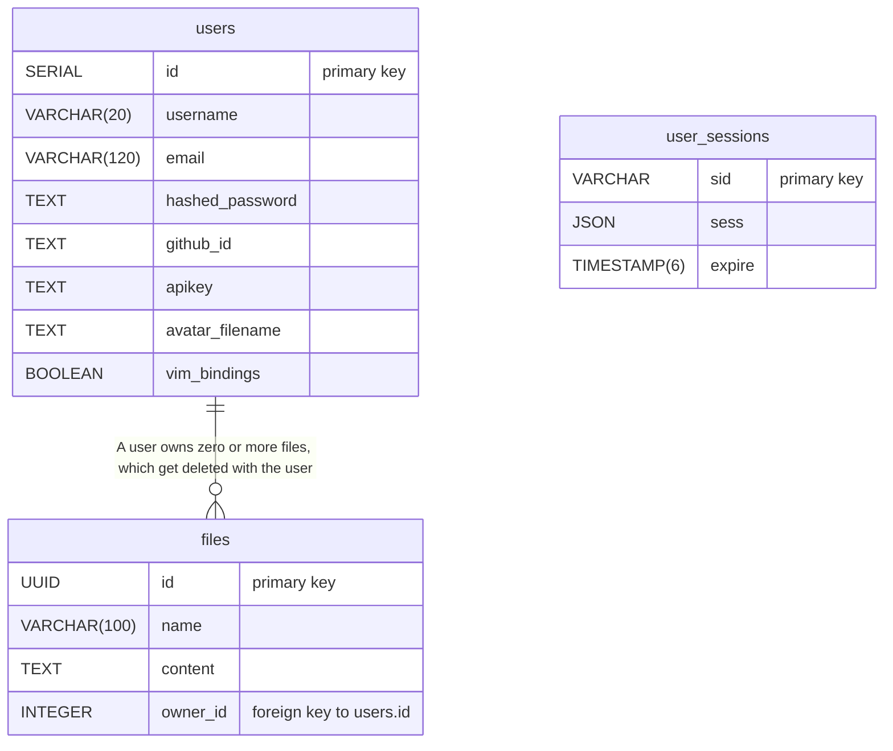

_This project has been created as part of the 42 curriculum by [ekeinan](https://github.com/EvAvKein), [juaho](https://github.com/EyzeCOLD), [jpiensal](https://github.com/Sky11y), [ltaalas](https://github.com/Omppu0)_

# DiffEd

## Table of Contents

- [Description](#description)
- [Instructions](#instructions)
- [Resources](#resources)
- [Team Information](#team-information)
- [Project Management](#project-management)
- [Technical Stack](#technical-stack)
- [Database Schema](#database-schema)
- [Features List](#features-list)
- [Modules](#modules)
- [Individual Contributions](#individual-contributions)

## Description

**DiffEd** is a real-time, diff-based, collaborative code editor. Collaborators each edit their own files, and can pick any peer in the workspace to view a live unified diff between the files. Peer edits stream in instantly with no refresh required, and users can accept file changes from peers through Accept buttons in diff chunks.

Key features:

- Real-time multi-user collaborative editing, powered by Operational Transformation
- Syntax highlighting for a lot of common languages (Markdown, TypeScript, Python, HTML, CSS, SQL, and more)
- Unified diff view for comparing file contents between collaborators
- Optional Vim keybindings in the editor
- Personal file storage with upload, download, rename, and delete
- Secure user accounts with session persistence, including GitHub OAuth
- Fully containerized deployment

## Instructions

**Prerequisites**

| Software       | Minimum version                                                                   |
| -------------- | --------------------------------------------------------------------------------- |
| Docker         | 24.x                                                                              |
| Docker Compose | v2 (bundled with Docker Desktop, or with Docker Engine's `docker-compose-plugin`) |
| Node.js        | 18.x (optional - only needed to run `npm run` scripts from the repo root)         |

The root `npm run` scripts are thin wrappers around `docker compose` commands. If you prefer, you can run the Docker Compose commands in `package.json` directly without Node.js installed.

**Setup**

1. Clone the repository:

   ```sh
   git clone <repo-url> && cd DiffEd
   ```

2. Create the environment file from the template:

   ```sh
   cp backend/.env.example backend/.env
   ```

   Open `backend/.env` and fill in the required values:

   ```
   POSTGRES_DB=your_database_name_here
   POSTGRES_USER=your_database_user_here
   POSTGRES_PASSWORD=your_database_password_here
   GITHUB_CLIENT_ID=your_github_client_id
   GITHUB_CLIENT_SECRET=your_github_client_secret
   SESSION_SECRET=your_session_secret_here
   ```

3. If you want GitHub authentication to work, create a [GitHub OAuth app](https://docs.github.com/en/apps/oauth-apps/building-oauth-apps/creating-an-oauth-app) and copy the [created OAuth app](https://github.com/settings/developers)'s `GITHUB_CLIENT_ID` and `GITHUB_CLIENT_SECRET` values into `backend/.env`. Otherwise, only authentication with email/username and password will work.

4. Build and start all services:
   ```sh
   npm run up
   ```
   This builds and starts the frontend, backend, PostgreSQL database, and Nginx reverse proxy. The app will be available at **http://localhost:8080**.

**Other useful commands**

| Command             | Description                                                        |
| ------------------- | ------------------------------------------------------------------ |
| `npm run dev`       | Start in development mode (auto-rebuild both frontend and backend) |
| `npm run stop`      | Stop running containers without removing them                      |
| `npm run start`     | Restart previously stopped containers                              |
| `npm run logs`      | Tail container logs                                                |
| `npm run fclean`    | Tear down containers and delete volumes (resets the database)      |
| `npm run re`        | Full teardown and rebuild from scratch                             |
| `npm run SA`        | Run static analysis (ESLint + Prettier) in a container             |
| `npm run audit`     | Run `npm audit` across the root, shared, backend, and frontend     |
| `npm run auditFix`  | Run `npm audit fix` across the root, shared, backend, and frontend |
| `npm run githook`   | Install the repo's pre-push git hook locally                       |
| `npm run cloneWiki` | Clone the repository wiki into `./wiki/`                           |

## Resources

**Collaborative editing**

- [CodeMirror collaborative editing example](https://codemirror.net/examples/collab/): Reference for our Operational Transformation implementation
- [Operational Transformation (Wikipedia)](https://en.wikipedia.org/wiki/Operational_transformation): Extra reading material

**Authentication**

- [GitHub OAuth documentation](https://docs.github.com/en/apps/oauth-apps/building-oauth-apps/creating-an-oauth-app): GitHub OAuth app setup instructions

**Accessibility**

- [WCAG 2.1 Quick Reference](https://www.w3.org/WAI/WCAG22/quickref/?versions=2.1&levels=aa): Accessibility compliance guidelines used for development

**AI usage**

We use AI tools in this project for:

- Generating initial drafts of documentation
- Assistance debugging obscure issues
- Writing boilerplate and automating easy refactors, which were then heavily reviewed by team members

All AI code was thoroughly reviewed and tested before being merged.

## Team Information

| Member                                     | Role(s)                        | Responsibilities                                                                                                                    |
| ------------------------------------------ | ------------------------------ | ----------------------------------------------------------------------------------------------------------------------------------- |
| [Eve Keinan](https://github.com/EvAvKein)  | Technical Lead / Architect     | Defines architecture and tech stack decisions. Ensures code quality and best practices. Reviews critical changes.                   |
| [Jukka Aho](https://github.com/EyzeCOLD)   | Project Manager / Scrum Master | Facilitates team coordination. Organises meetings and planning sessions. Tracks progress and deadlines. Manages risks and blockers. |
| [Jyri Piensalo](https://github.com/Sky11y) | Product Owner                  | Defines product vision and prioritises features. Maintains the product backlog. Validates completed work.                           |
| [Luka Taalas](https://github.com/Omppu0)   | Developer                      | Contributes to implementation of modules. Participates in code reviews. Thoroughly tests team's implementations.                    |

**All team members regularly contributed to the developer responsibilities**

## Project Management

**Work organisation**

The team works in 2-week sprints, aiming towards code-named release-based version milestones (e.g. Cherry, Pineapple, Cactus). Each version added a defined scope of features agreed on upfront, and the team checks in regularly (remotely and in person) to track progress and resolve blockers.

**Tools**

- **GitHub Projects**: Issue tracking and feature backlog.
- **GitHub Pull Requests**: All changes go through PRs with a mandatory review by at least one peer. PRs are open to change requests if needed before merge.
- **Discord**: Main communication channel for async discussion and coordination.

## Technical Stack

**Frontend**

- TypeScript: Type-safe JavaScript across the entire codebase
- React: Web component framework
- React Router: Client-side routing
- CodeMirror: Extensible code editor component
- SocketIO: WebSocket client library
- Tailwind: Utility styling-classes
- Zustand: Minimal global state management
- Vite: Build tooling and dev server

**Backend**

- TypeScript: Type-safe JavaScript across the entire codebase
- Node.js: Backend JavaScript runtime
- Express: Backend web API framework
- SocketIO: WebSocket server library
- Postgres: ACID-compliant relational database
- express-session + connect-pg-simple: Server-side session management with Postgres integration
- express-rate-limit: Rate-limiting middleware for endpoints
- helmet: sets response HTTP headers
- PassportJS: Authentication middleware (used for GitHub OAuth)
- Argon2id (`argon2`): Password hashing
- Multer: Multipart file upload handling
- Zod: Schema-based input validation library

**Deployment**

- Docker: Container runtime
- Docker Compose: Multi-container orchestration manager
- Nginx: Reverse proxy and SSL handler

**Development Tooling**

- ESLint: Linting / Static analysis
- Prettier: Code formatting

## Database Schema

The project uses a PostgreSQL database with three tables - `users` (accounts), `files` (text file storage), and `user_sessions` (server-side sessions). The schema is defined in SQL files stored at `backend/sql/`, and gets applied on startup via `backend/src/postgres.ts`.



With the `user_session` table being fully managed by the package `connect-pg-simple`, this table has no foreign key to `users`: The relation between sessions and users is established via a `userId` stored inside the `sess` JSON.

User Avatar images are stored in a local volume, that the users `avatar_filename` field points to.

## Features List

| Feature                  | Description                                                                                                                                           | Contributor(s)         |
| ------------------------ | ----------------------------------------------------------------------------------------------------------------------------------------------------- | ---------------------- |
| Real-time collaboration  | Live text editing in multi-user, multi-file sessions - synchronised through Operational Transformation over WebSockets                                | Eve                    |
| Rich editing features    | Syntax highlighting for 17 languages, Vim keybindings, and unified diff views for comparing with peer files (with chunk-based changes Accept buttons) | Eve                    |
| File management          | Create, upload, download, rename, and delete personal files                                                                                           | Luka, Jukka, Eve       |
| File browser             | Paginated file list with name sorting and search filtering                                                                                            | Jukka                  |
| GitHub OAuth             | GitHub OAuth authentication for sign up and login, with GitHub-auth linking and unlinking                                                             | Eve                    |
| User accounts            | Email/username + password signup and login, with Argon2id password hashing                                                                            | Jyri                   |
| User avatars             | Upload, replace, and delete a profile avatar, with a default fallback                                                                                 | Jyri                   |
| Session persistence      | Server-side sessions stored in PostgreSQL - users stay logged in across refreshes                                                                     | Jyri                   |
| Accessibility            | WCAG 2.1 AA compliance: Keyboard navigation, high color contrast, labelled controls, screenreader live regions                                        | Eve, Jukka             |
| Account settings         | Manage username, email, password, API keys, GitHub link, Vim preference, and account deletion                                                         | Jyri, Jukka, Eve       |
| Public REST API          | Public endpoints for accounts, files, and workspaces, with API-key authenticated access                                                               | Jyri, Luka, Jukka, Eve |
| API documentation        | In-app reference page documenting the public API endpoints                                                                                            | Jyri, Eve              |
| Toast notifications      | Feedback for user actions via success, error, and info messages                                                                                       | Eve                    |
| Containerized deployment | Docker Compose orchestration of a frontend, backend, database, and Nginx reverse proxy                                                                | Eve                    |

## Modules

This project implements **14 points** worth of modules. **Major** modules are worth 2 points each, and **Minor** modules 1 point each.

| Tier      | Count  | Points |
| --------- | ------ | ------ |
| Major     | 4      | 8      |
| Minor     | 6      | 6      |
| **Total** | **10** | **14** |

### Major modules

**Both frontend and backend frameworks** - 2 pts

- _Justification:_ A frontend framework helps in building browser applications, through abstracting away complex state management and rendering updates. A backend framework helps by abstrating away core routing setup and session management.
- _Implementation:_ React bundled by Vite on the frontend, Express on Node.js for the backend, both written completely in TypeScript with a shared types package to ensure consistency throughout the codebase.
- _Contributors:_ Eve

**Real-time features with WebSockets** - 2 pts

- _Justification:_ Sockets are essential for real-time collaborative editing, allowing low-latency, bidirectional communication between clients and the server to synchronise edits across users.
- _Implementation:_ Socket.IO connections link editor clients to the backend, which serves as the central authority for collaboration. File edits are transmitted and reconciled with Operational Transformation actions.
- _Contributors:_ Eve

**WCAG accessibility compliance** - 2 pts

- _Justification:_ Accessibility is a core requirement for any user-facing application, and WCAG 2.1 AA is a widely recognised standard that ensures the app is usable by people with a wide range of disabilities.
- _Implementation:_ The UI targets WCAG 2.1 AA: Semantic HTML, high-contrast text and icons, labelled inputs, keyboard navigation, and `aria-live` regions for dynamic updates.
- _Contributors:_ Eve, Jukka

**Public API** - 2 pts

- _Justification:_ A public API allows clients to interact with the application's core features programmatically, enabling integrations, automation, and third-party tool development that can enhance the app's user experience.
- _Implementation:_ Users generate a personal API key in their account settings: The key authenticates requests to the account, file, and workspace endpoints, which are described on an in-app documentation page.
- _Contributors:_ Jyri, Luka, Jukka, Eve

### Minor modules

**Real-time collaboration (workspaces, live editing)** - 1 pt

- _Justification:_ Real-time collaborative editing is a fundamental feature of the app, and shared workspaces allow multiple users to collaborate simultaneously.
- _Implementation:_ Collaborators join a shared workspace with their chosen file, and can view a live unified diff against the file of any peer. Peer edits stream in with no refresh required.
- _Contributors:_ Eve

**Complete notification system** - 1 pt

- _Justification:_ User feedback is essential for a good user experience, and a global toast system provides a channel for messages that inform users about the success, failure, or status of their actions across the app without cluttering the interfaces with in-page notifications.
- _Implementation:_ A global toast store manages and handles the IO of success, error, and info messages across the app. Toasts are displayed in a corner of the core layout, for a duration adjusted according to the message length.
- _Contributors:_ Eve

**Advanced search** - 1 pt

- _Justification:_ _To be added by the team._
- _Implementation:_ _To be added by the team_
- _Contributors:_ Jukka

**File upload & management** - 1 pt

- _Justification:_ _To be added by the team._
- _Implementation:_ _To be added by the team._
- _Contributors:_ Luka, Jukka

**Support for two additional browsers** - 1 pt

- _Justification:_ Supporting multiple browsers ensures a wider user base can access the app and use it as intended.
- _Implementation:_ The app is tested and styled to work across Chromium browsers and Firefox, with team members defaulting to different browsers during development.
- _Contributors:_ Jyri, Luka, Jukka, Eve

**Remote authentication (GitHub)** - 1 pt

- _Justification:_ Remote authentication via a trusted third party like GitHub provides users with a convenient and secure way to sign up and log in without creating yet another password, while allowing them to link their GitHub account for potential future integrations.
- _Implementation:_ GitHub OAuth via Passport.js lets users sign up, log in, and link/unlink a GitHub account.
- _Contributors:_ Eve

## Individual Contributions

### Eve Keinan ([EvAvKein](https://github.com/EvAvKein))

**Contributions**

- Project skeleton and architecture - containerized fullstack scaffolding, the TypeScript frontend/backend/shared monorepo, and absolute-path imports
- Real-time collaborative editing - the Operational Transformation engine synchronising edits over Socket.IO, with the backend as the central authority
- Workspaces - shared multi-user collaboration sessions, with member slots, disconnect grace periods, and edit streaming and persistence
- Unified diff view - live per-peer diff comparison with per-chunk Accept buttons
- Multi-language syntax highlighting - CodeMirror language extensions with overridable language detection by file extension
- Vim keybindings - toggleable Vim mode in the editor and settings, with a custom Escape key handler to support tab insertions without breaking tab navigation
- GitHub OAuth - PassportJS sign-up, login, and account linking/unlinking
- Frontend session handling - a user store, auto-login, and session-aware routing
- Toast notifications - the global toast store for user action feedback, with screenreader support and dynamic duration based on message length
- Public API authentication - API-key auth middleware wired into the account, file, and workspace endpoints, plus API documentation page
- Accessibility - high color contrast, skip-to-content, labelled icon buttons, screenreader live regions and ARIA tags, and system-color editor selections
- Project tooling - dependency audit scripts, the wiki-clone script, centralized env loading, and the README

**Modules:** Both frontend and backend frameworks, Real-time features with WebSockets, WCAG accessibility compliance, Real-time collaboration, Complete notification system, Remote authentication. Contributed to the Public API, and Support for two additional browsers.

**Challenges faced:** _To be added by the team._

### Jyri Piensalo ([Sky11y](https://github.com/Sky11y))

**Contributions**

- User accounts - the email/username sign-up and login, with Argon2id password hashing
- Account settings - the user-management page for changing username, email, and password, plus account deletion
- User avatars - uploading, replacing, and deleting a profile avatar, with a default fallback
- Public API - the public account endpoints and the `requireAuthOrApiKey` authentication middleware
- API keys - personal API key generation, copying, and deletion
- Session backend - server-side session management and persistance
- Database query separation - extracting database queries into dedicated query-service modules
- API documentation - drafted core structure of the API reference page

**Modules:** Public API. Contributed to Support for two additional browsers.

**Challenges faced:**

- Making passport.js to work. Eventually Eve made this work for OAuth.
- Struggling with Typescript.

### Jukka Aho ([EyzeCOLD](https://github.com/EyzeCOLD))

**Contributions**

- File browser - the file list layout, pagination, name sorting, and search filtering
- Frontend file validation - file type and size checks, and filename collision detection
- Download button - the file download control
- Endpoint refactoring - standardising the user-management and general API endpoints, including the `isUniqueViolation` helper
- Accessibility - contrast fixes, screenreader compatibility improvements, and keyboard-navigation fixes
- Shared components - reusable Input, Button, ResettingForm, and DeleteButton components
- Account settings - contributed to the user-management page styling and inputs
- Pre-push githook - the repository's pre-push git hook

**Modules:** Advanced search, the public API. contributed to WCAG accessibility compliance, File upload & management, and Support for two additional browsers.

**Challenges faced:** _To be added by the team._

### Luka Taalas ([Omppu0](https://github.com/Omppu0))

**Contributions**

- Backend file management - the file upload (Multer), retrieval, and delete endpoints
- Backend file validation - file-type and size capping on uploads
- Multi-call uploads - handling file uploads as multiple independent requests
- File list optimization - trimming the file endpoints to return only the data the list needs, with a partial `ListUserFile` type
- Upload UX - appending and removing files in the upload list, and error handling on failed uploads
- Public API - contributed to the public file endpoints

**Modules:** File upload & management, the Public API. Contributed to support for two additional browsers.

**Challenges faced:** _To be added by the team._

_All team members also contributed to code reviews and to developer responsibilities across the codebase._
